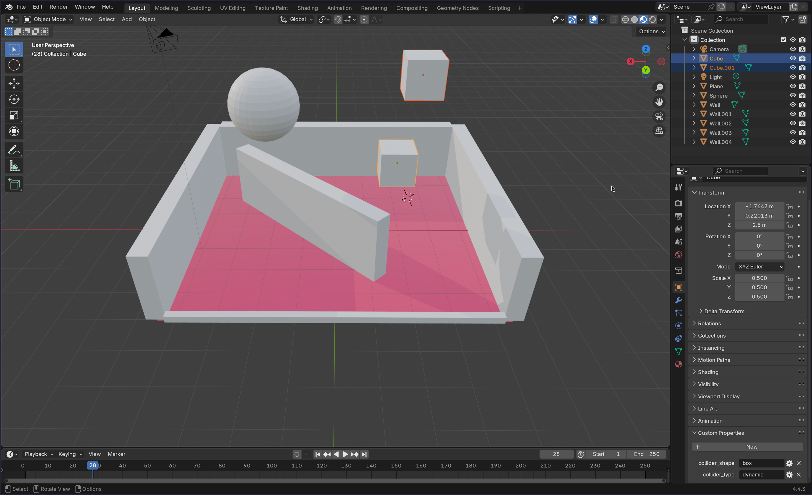
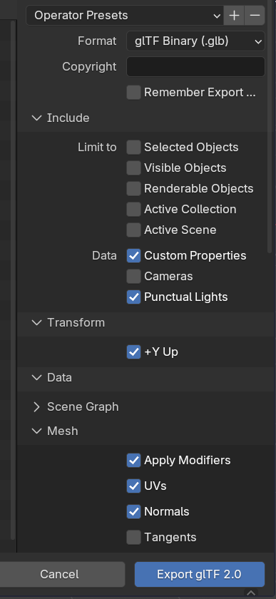
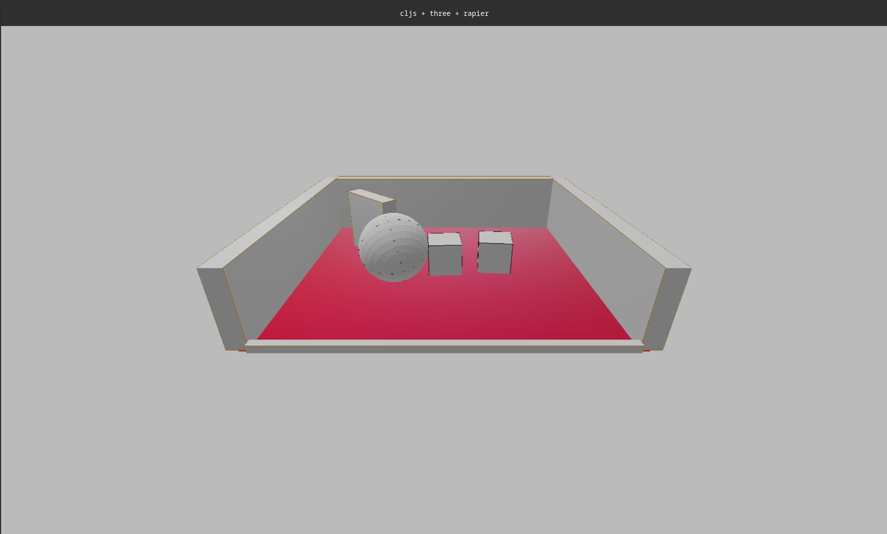

# cljs-threejs-rapier-recast

A focused exploration of the integration between ClojureScript, Three.js, Rapier physics engine and the Recast navmesh generation and navigation.

> **Note:** The code within this repository is part of an initial exploration and may not reflect production-ready quality or best practices.

## Workflow

The primary objective of this repository is to evaluate the ergonomics and efficiency
of a workflow that utilizes Blender for scene design and ClojureScript for implementing
the main application logic, with the goal of achieving a game engine-like development experience.

### Blender

The base Blender scene used in this study can be found at `resources/source/test-scene.blend`.
Note the "Custom Properties" panel in the lower right section of the Blender interface.
This is the method used to embed data for configuring rigid bodies within the physics engine.



The GLTF export configuration employed for this workflow includes the following considerations:

- Punctual Lights
- Custom Properties
- Apply Modifiers (Optional)



The resulting output after rendering the scene and enabling the physics simulation demonstrates the integration of these technologies.



The navimesh is being generated considering only "static" flagged objects.

## Requirements
- [npm](https://www.npmjs.com/)
- [clojure](https://clojure.org/)

## Instructions

### Bootstrap
```bash
npm install
```

### Watch on http://localhost:5000
```bash
npm start
```

### Release Build (release/public)
```bash
npm run release
```

#### Serve Release bundle
```bash
gzip resources/public/js/*.js
npx http-server resources/public -g
```

## Javascript Libraries
- [three](https://github.com/mrdoob/three.js)
- [rapier](https://github.com/dimforge/rapier.js)
- [recast](https://github.com/isaac-mason/recast-navigation-js)

## Another studies
- [cljs-babylon-havok](https://github.com/rafaeldelboni/cljs-babylon-havok)
- [cljs-threejs-rapier](https://github.com/rafaeldelboni/cljs-threejs-rapier)
